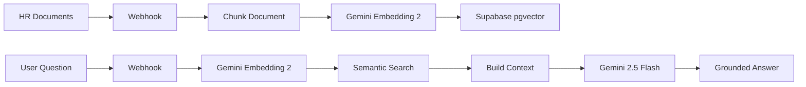
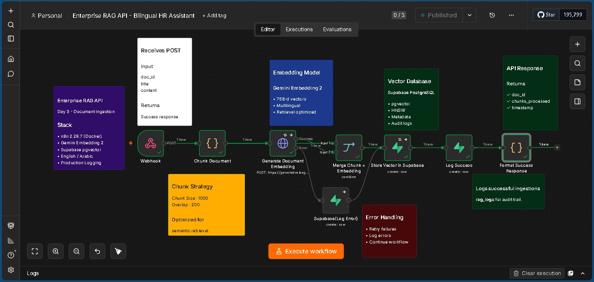
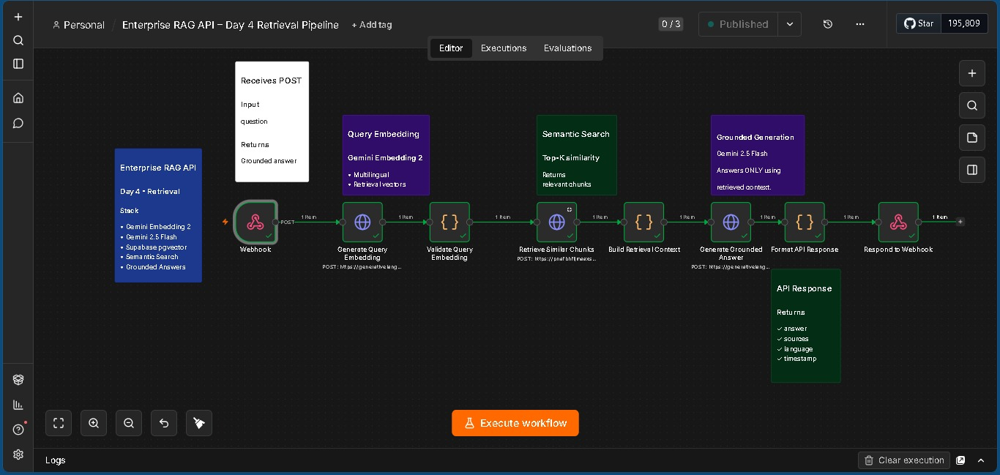
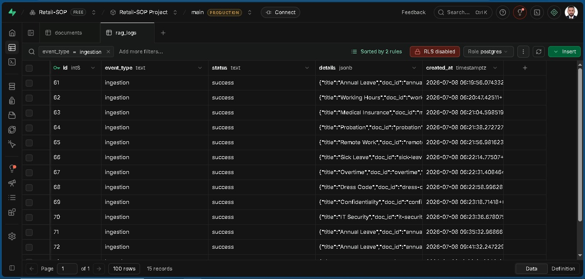
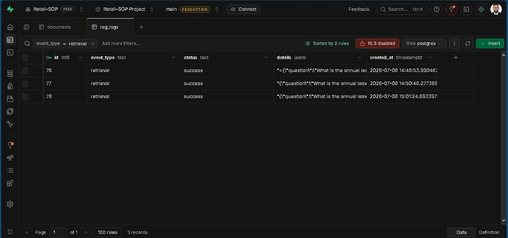
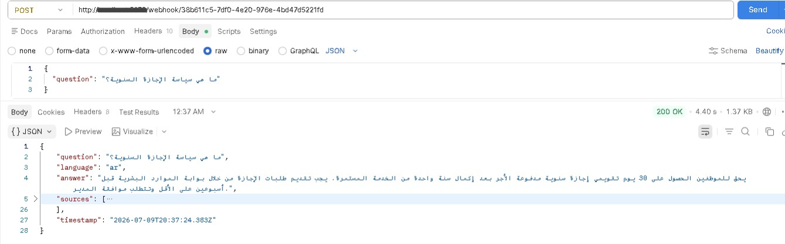
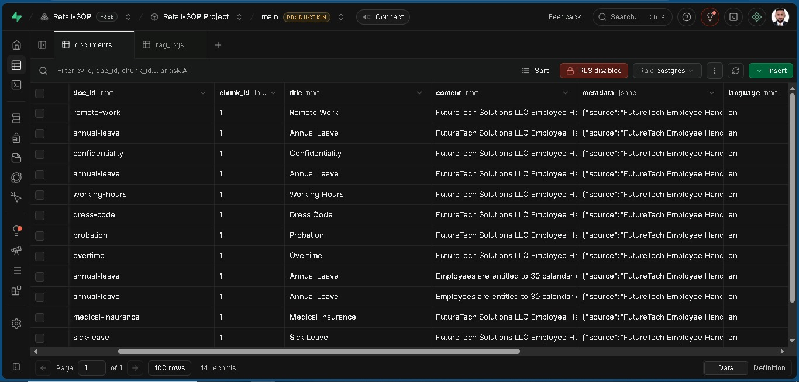
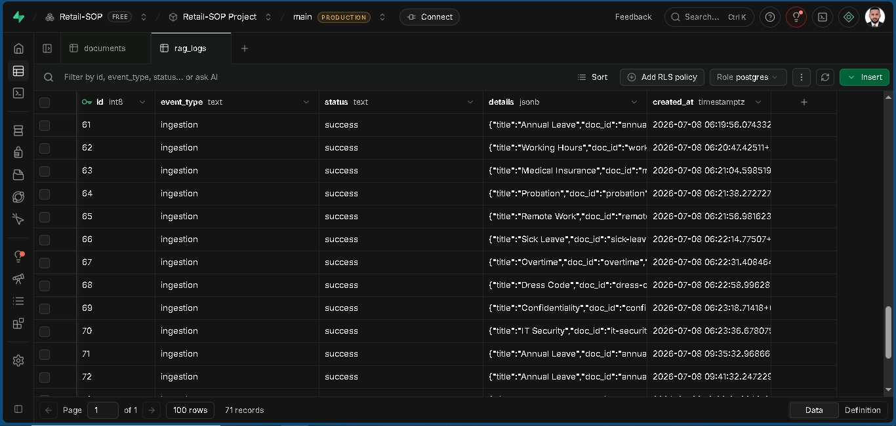

# Enterprise RAG API – Bilingual HR Assistant 🇦🇪


> Production-ready Retrieval-Augmented Generation (RAG) API built with **n8n**, **Gemini**, and **Supabase pgvector** for enterprise HR knowledge bases.

---

# Business Problem

Enterprise HR knowledge is often scattered across employee handbooks, SOPs, policy documents, and internal PDFs.

Traditional keyword search is slow, inaccurate, and frequently returns irrelevant results.

This project solves that problem by building a complete **Retrieval-Augmented Generation (RAG)** system that performs semantic search over enterprise knowledge and generates grounded AI answers using only approved company information.

---

# Project Overview

This project consists of two production-ready n8n workflows.

## Workflow 1 – Document Ingestion

Receives HR documents through an API, splits them into semantic chunks, generates vector embeddings using Gemini Embedding 2, and stores them inside Supabase pgvector.

## Workflow 2 – Retrieval API

Receives a user question, performs semantic similarity search, builds retrieval context, generates a grounded answer using Gemini 2.5 Flash, and returns a structured API response.

---

# Key Features

- Enterprise document ingestion
- Semantic search using pgvector
- Gemini Embedding 2
- Gemini 2.5 Flash
- English & Arabic ready
- Metadata support
- Source citations
- Production-ready API responses
- Error handling
- Audit logging
- Modular n8n workflows
- Docker deployment

---

# Architecture



---

# Technology Stack

| Layer | Technology |
|--------|------------|
| Workflow Automation | n8n 2.28.7 (Docker) |
| AI Embeddings | Gemini Embedding 2 |
| LLM | Gemini 2.5 Flash |
| Database | PostgreSQL |
| Vector Database | Supabase pgvector |
| Vector Index | HNSW |
| Backend | REST API |
| Language | JavaScript |
| Testing | Postman |

---

# Workflow 1 – Document Ingestion

### Pipeline

```
Webhook
      ↓
Chunk Document
      ↓
Gemini Embedding 2
      ↓
Supabase pgvector
      ↓
Success / Error Logging
```

### Responsibilities

- Receive enterprise documents
- Split documents into semantic chunks
- Generate embeddings
- Store vectors
- Save metadata
- Handle failures
- Write audit logs

---

# Workflow 2 – Retrieval API

### Pipeline

```
Webhook
      ↓
Generate Query Embedding
      ↓
Semantic Search
      ↓
Build Retrieval Context
      ↓
Gemini 2.5 Flash
      ↓
Format Response
      ↓
Respond to Webhook
```

### Responsibilities

- Receive user questions
- Generate query embeddings
- Perform semantic search
- Build retrieval context
- Generate grounded AI answers
- Return structured JSON responses

---

# Example API Request

```json
{
    "question":"What is the annual leave policy?"
}
```

---

# Example API Response (en)

```json
{
  "question":"What is the annual leave policy?",
  "language":"en",
  "answer":"Employees are entitled to 30 calendar days of paid annual leave after completing one year of continuous service.",
  "sources":[
      {
      "source": "FutureTech Employee Handbook 2026.pdf",
      "page": 14,
      "similarity": 0.891
    }
  ],
  "timestamp":"2026-07-09T15:13:28Z"
}
```

# Example API Response (ar)

```json
{
  "question": "كم يوم إجازة سنوية؟",
  "language": "ar",
  "answer": "يحق للموظف الحصول على 30 يوماً تقويمياً إجازة سنوية مدفوعة الأجر بعد إكمال سنة خدمة متواصلة...",
  "sources": [
    {
      "source": "FutureTech Employee Handbook 2026.pdf",
      "page": 14,
      "similarity": 0.891
    }
  ],
  "timestamp": "2026-07-09T15:15:28Z"
}
```

# Database Schema

## documents

Stores document chunks together with vector embeddings.

Columns

- id
- doc_id
- chunk_id
- title
- content
- metadata
- embedding
- language
- supported_languages
- created_at

---

## rag_logs

Stores ingestion audit logs.

Columns

- event_type
- status
- details
- created_at

---

# Screenshots

## Document Ingestion Workflow



---

## Retrieval Workflow



---

## Successful Ingestion Execution



---

## Successful Retrieval Execution



---

## API Response (Postman)



---

## Supabase Documents Table



---

## Audit Logs



---

# Repository Structure

```
enterprise-rag-api-bilingual-hr-assistant
│
├── README.md
│
├── workflows
│   ├── day3-ingestion.json
│   └── day4-retrieval.json
│
├── screenshots
│   ├── 01-ingestion-workflow.png
│   ├── 02-retrieval-workflow.png
│   ├── 03-ingestion-success.png
│   ├── 04-retrieval-success.png
│   ├── 05-postman-response.png
│   ├── 06-documents-table.png
│   └── 07-rag-logs.png
│
└── docs
    └── architecture.png
```

---

# Skills Demonstrated

- n8n Workflow Automation
- AI Automation
- Retrieval-Augmented Generation (RAG)
- Prompt Engineering
- Semantic Search
- Vector Databases
- Supabase
- PostgreSQL
- pgvector
- Gemini APIs
- REST APIs
- JavaScript
- Enterprise Workflow Design
- Docker

---

# Enterprise Use Cases

This architecture can be adapted for:

- HR Assistants
- Employee Handbooks
- Company SOP Search
- Compliance Documentation
- Healthcare Knowledge Bases
- Real Estate Knowledge Bases
- Legal Document Search
- Internal Enterprise Search
- Customer Support Knowledge Bases

---

# Roadmap

- Arabic semantic retrieval
- Metadata filtering
- Multi-document upload
- PDF ingestion
- Google Drive integration
- WhatsApp AI Assistant
- Streaming responses
- Authentication
- Docker Compose
- CI/CD Deployment

---

# Getting Started

1. Clone this repository.
2. Import both workflow JSON files into n8n.
3. Configure:
   - Gemini API Key
   - Supabase URL
   - Supabase Service Role Key
4. Create the PostgreSQL tables and enable pgvector.
5. Execute the ingestion workflow to index documents.
6. Query the retrieval API using Postman or any HTTP client.

---

# Author

## Toqeer Ahmad

Dubai, UAE 🇦🇪

Building production-ready AI Automation, RAG, and Enterprise Workflow solutions using **n8n**, **Gemini**, **Supabase**, and **Docker**.

Currently completing a **30-Day AI Automation & RAG Engineering Sprint** focused on enterprise-grade AI systems for the UAE market.

Open to opportunities as:

- AI Automation Engineer
- n8n Developer
- RAG Engineer
- AI Solutions Engineer
- AI Workflow Consultant

**Location:** Dubai • UAE • Remote
